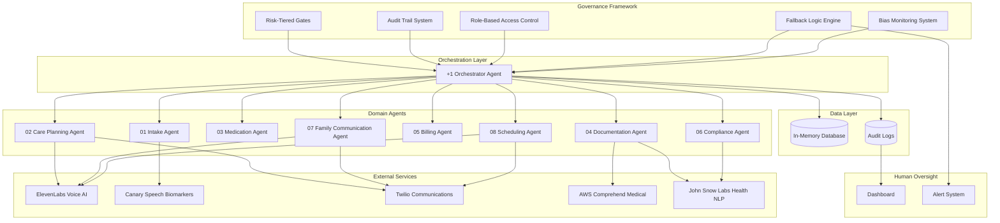
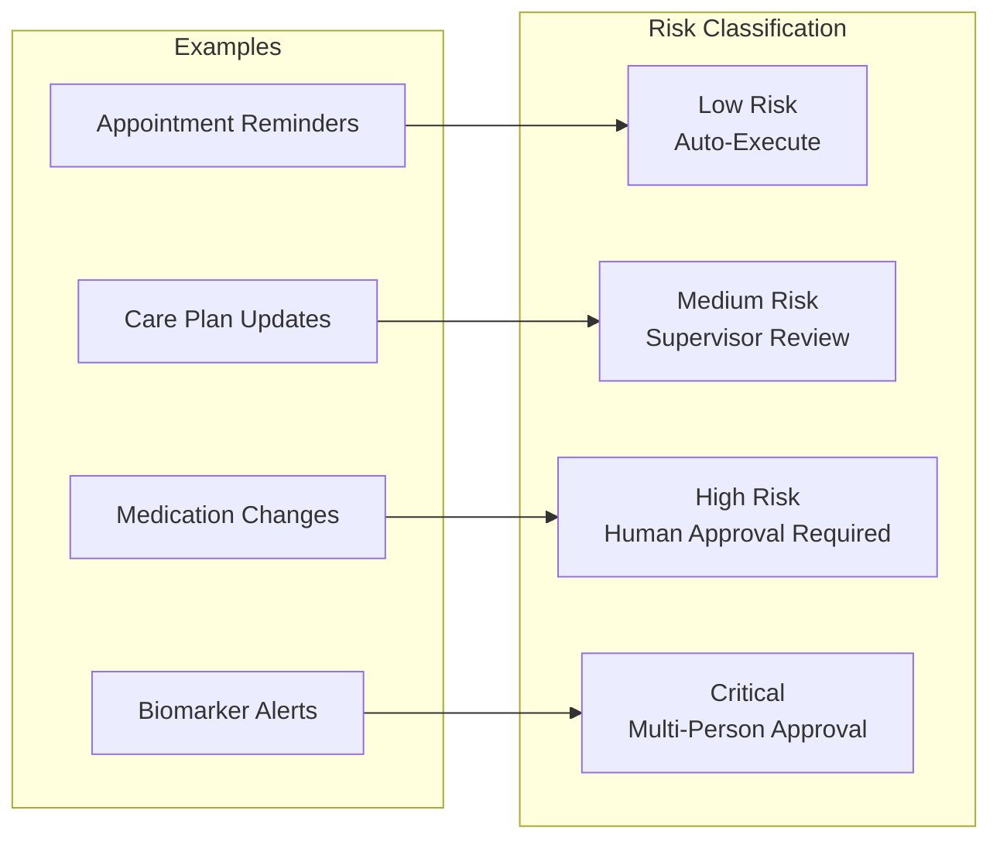
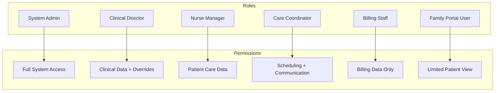
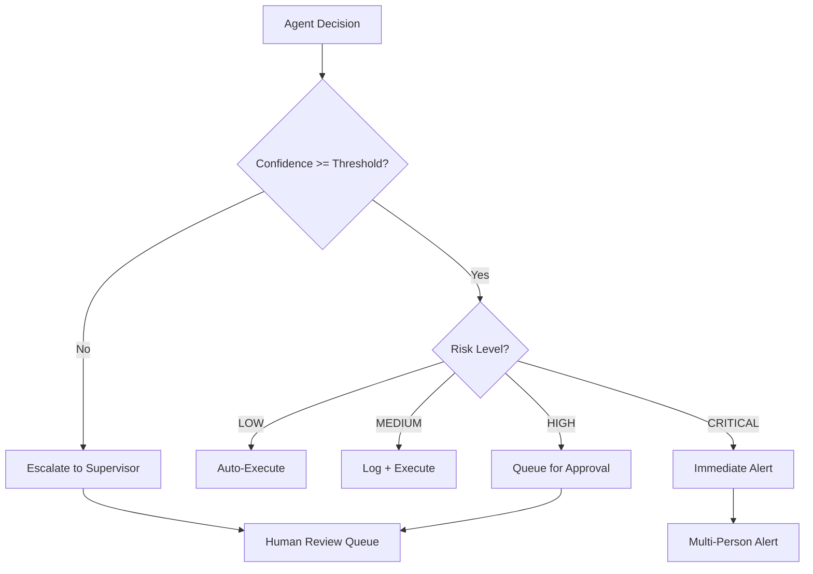
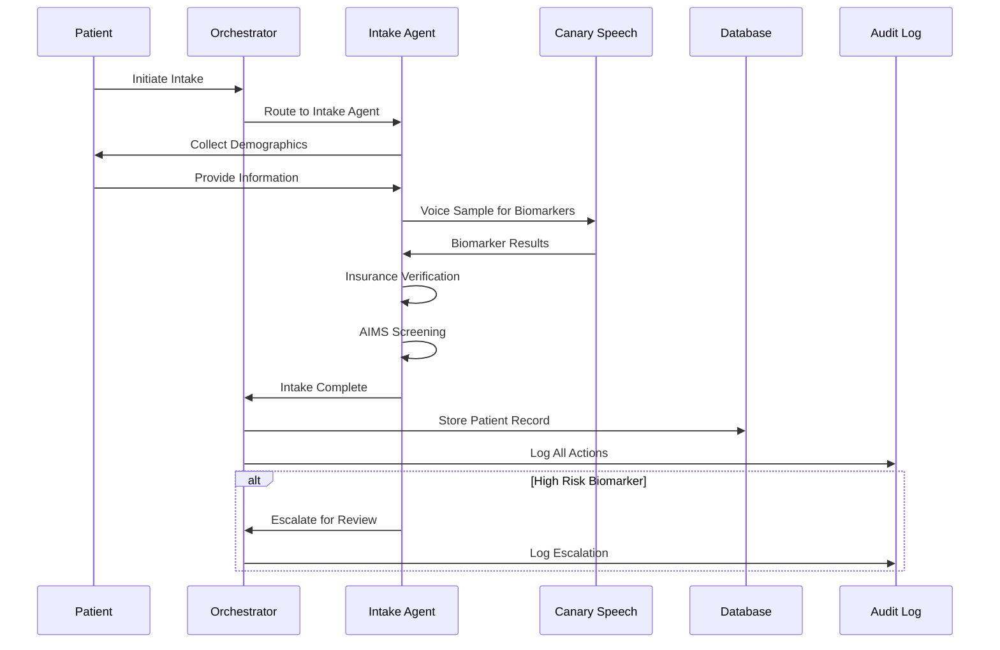
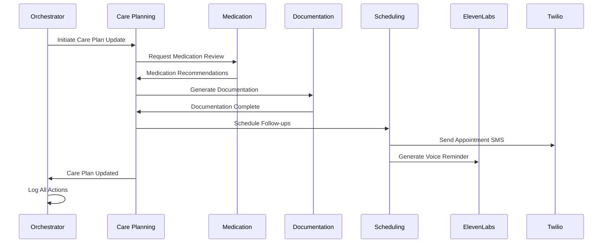
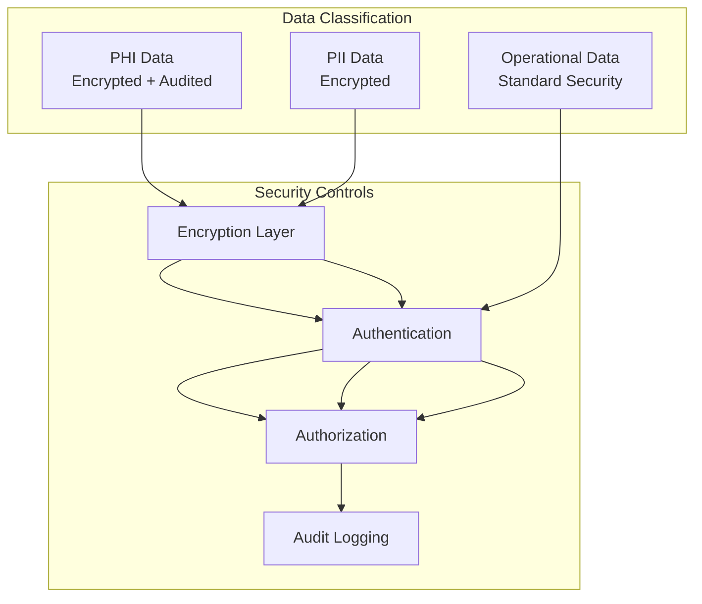

# Healthcare 8+1 Agent Architecture: Governance Framework and Workflow Design Document

## Executive Summary

This document describes a comprehensive governance framework for an 8+1 Agent Architecture designed to orchestrate healthcare workflows across the care continuum. The system starts with intake automation and scales to full operations, incorporating eight domain-specific agents plus one orchestrator agent for unified compliance oversight.

## Table of Contents

1. [Architecture Overview](#architecture-overview)
2. [Agent Specifications](#agent-specifications)
3. [Five-Layer Governance Framework](#five-layer-governance-framework)
4. [External Service Integrations](#external-service-integrations)
5. [Data Flow and Workflow Diagrams](#data-flow-and-workflow-diagrams)
6. [Security and Compliance](#security-and-compliance)
7. [Testing Strategy](#testing-strategy)

---

## Architecture Overview

### High-Level Architecture Diagram



### System Components

The architecture consists of three primary layers:

**Orchestration Layer**: The +1 Orchestrator Agent serves as the central coordinator, routing requests to appropriate domain agents, enforcing governance policies, and maintaining unified logging across all operations.

**Domain Agent Layer**: Eight specialized agents handle specific workflow domains including intake processing, care planning, medication management, documentation, billing, compliance, family communication, and scheduling.

**Governance Layer**: A five-layer framework ensures clinical safety through risk-tiered gates, complete audit trails, role-based access control, fallback logic, and bias monitoring.

---

## Agent Specifications

### +1 Orchestrator Agent

**Purpose**: Central coordination hub for all agent activities with unified compliance oversight.

**Responsibilities**:
- Route incoming requests to appropriate domain agents
- Enforce governance policies across all operations
- Maintain unified logging and audit trails
- Coordinate multi-agent workflows
- Apply confidence thresholds and escalation rules

**Key Features**:
- Workflow state management
- Cross-agent communication protocol
- API call routing with unified logging
- Real-time monitoring and alerting

### 01 Intake Agent

**Status**: Validated in Production

**Purpose**: Handle patient registration, screening, insurance verification, and compliance documentation.

**Responsibilities**:
- Patient registration and demographic collection
- AIMS (Admission, Intake, and Medical Screening) processing
- Insurance verification and eligibility checks
- Compliance documentation generation
- Voice-based biomarker screening via Canary Speech

**Integrations**:
- Canary Speech: Voice biomarker analysis for mood/disease indicators during initial interactions
- EHR Systems: Patient data synchronization

**Accuracy Target**: 99.5%

### 02 Care Planning Agent

**Status**: Designed

**Purpose**: Manage MDS coordination, interdisciplinary care team communication, and plan updates.

**Responsibilities**:
- MDS (Minimum Data Set) assessment coordination
- Interdisciplinary care team (IDT) communication
- Care plan creation and updates
- Goal tracking and progress monitoring

**Integrations**:
- ElevenLabs: Voice-enabled team updates and notifications
- Twilio: SMS and voice communication for care team coordination

### 03 Medication Agent

**Status**: Designed

**Purpose**: Oversee pharmacy coordination, medication reconciliation, and adverse event monitoring.

**Responsibilities**:
- Pharmacy order coordination
- Medication reconciliation across care settings
- Drug interaction checking
- Adverse event detection and reporting
- Refill management and compliance tracking

**Integrations**:
- Pharmacy databases (simulated)
- Drug interaction databases

### 04 Documentation Agent

**Status**: Designed

**Purpose**: Manage progress notes, regulatory reporting, and quality metrics tracking.

**Responsibilities**:
- Progress note generation and management
- Regulatory report compilation
- Quality metrics tracking and reporting
- Clinical entity extraction from text

**Integrations**:
- AWS Comprehend Medical: Healthcare NLP for medical entity extraction
- John Snow Labs Health NLP: Advanced clinical entity recognition

### 05 Billing Agent

**Purpose**: Handle revenue cycle management and claims processing.

**Responsibilities**:
- Claims generation and submission
- Revenue cycle management
- Denial management and appeals
- Payment posting and reconciliation
- Coding accuracy verification

### 06 Compliance Agent

**Purpose**: Manage audit preparation and continuous monitoring.

**Responsibilities**:
- Regulatory compliance monitoring
- Audit preparation and documentation
- Policy enforcement verification
- Bias monitoring across all agent decisions
- Risk assessment and mitigation

**Integrations**:
- John Snow Labs: NLP tools for bias detection in clinical text

### 07 Family Communication Agent

**Purpose**: Handle family/caregiver communication and portal access.

**Responsibilities**:
- Family notification management
- Portal access coordination
- Care update communications
- Appointment reminders to family members
- Emergency contact management

**Integrations**:
- Twilio: SMS and voice communication
- ElevenLabs: AI-generated voice responses for automated calls

### 08 Scheduling Agent

**Purpose**: Manage appointments and therapy coordination.

**Responsibilities**:
- Appointment scheduling and management
- Therapy session coordination
- Resource allocation
- Automated reminder generation
- Calendar synchronization

**Integrations**:
- Twilio: SMS and voice reminders
- ElevenLabs: Voice-based scheduling interactions

---

## Five-Layer Governance Framework

### Layer 1: Risk-Tiered Gates



**Risk Categories**:

| Risk Level | Description | Approval Required | Examples |
|------------|-------------|-------------------|----------|
| LOW | Routine administrative tasks | None (auto-execute) | Appointment reminders, status updates |
| MEDIUM | Standard clinical operations | Supervisor notification | Care plan updates, documentation |
| HIGH | Clinical decisions with patient impact | Human approval | Medication changes, treatment modifications |
| CRITICAL | High-stakes clinical decisions | Multi-person approval | Biomarker alerts, emergency interventions |

### Layer 2: Complete Audit Trail

Every agent action is logged with:
- Timestamp (ISO 8601 format)
- Agent identifier
- Action type and parameters
- Decision rationale
- Confidence score
- API call details (for external services)
- Human override capability flag
- Outcome and any modifications

**Audit Log Schema**:
```json
{
  "log_id": "uuid",
  "timestamp": "ISO8601",
  "agent_id": "string",
  "action_type": "string",
  "patient_id": "string (encrypted)",
  "parameters": {},
  "rationale": "string",
  "confidence_score": 0.0-1.0,
  "risk_level": "LOW|MEDIUM|HIGH|CRITICAL",
  "api_calls": [],
  "human_override": false,
  "outcome": "string",
  "modifications": []
}
```

### Layer 3: Role-Based Access Control (RBAC)



**Permission Matrix**:

| Role | Intake | Care Plan | Medication | Documentation | Billing | Compliance | Communication | Scheduling |
|------|--------|-----------|------------|---------------|---------|------------|---------------|------------|
| System Admin | Full | Full | Full | Full | Full | Full | Full | Full |
| Clinical Director | Full | Full | Full | Full | Read | Full | Full | Full |
| Nurse Manager | Full | Full | Read | Full | None | Read | Full | Full |
| Care Coordinator | Read | Read | None | Read | None | None | Full | Full |
| Billing Staff | None | None | None | Read | Full | None | None | None |
| Family Portal | None | None | None | None | None | None | Limited | Read |

### Layer 4: Fallback Logic Engine

**Escalation Triggers**:
1. AI confidence score below threshold (configurable, default 0.85)
2. Ambiguous NLP extraction results
3. Conflicting information detected
4. System timeout or service unavailability
5. Patient safety concerns identified

**Escalation Flow**:


### Layer 5: Bias Monitoring System

**Monitoring Dimensions**:
- Demographic parity across patient populations
- Treatment recommendation consistency
- Wait time equity
- Resource allocation fairness
- Communication frequency balance

**Bias Detection Methods**:
- Statistical parity analysis
- Disparate impact ratio calculation
- NLP sentiment analysis across demographics
- Outcome tracking by population segment

---

## External Service Integrations

### ElevenLabs Voice AI

**Use Cases**:
- Text-to-speech for automated voice calls
- Conversational AI for scheduling interactions
- Voice-enabled care team updates

**Integration Points**:
- Care Planning Agent: Team update notifications
- Family Communication Agent: Automated family calls
- Scheduling Agent: Voice-based appointment reminders

**API Endpoints** (Simulated):
```python
# Text-to-Speech
POST /v1/text-to-speech/{voice_id}
{
    "text": "string",
    "model_id": "eleven_monolingual_v1",
    "voice_settings": {...}
}

# Conversational AI
POST /v1/convai/conversation
{
    "agent_id": "string",
    "text": "string"
}
```

### Canary Speech Biomarkers

**Use Cases**:
- Voice-based mood assessment during intake
- Disease indicator screening
- Mental health monitoring

**Integration Points**:
- Intake Agent: Initial biomarker screening

**API Endpoints** (Simulated):
```python
# Voice Analysis
POST /api/v1/analyze
{
    "audio_data": "base64",
    "analysis_type": ["mood", "cognitive", "respiratory"],
    "patient_id": "string"
}

# Response
{
    "confidence": 0.92,
    "indicators": {
        "mood": {"score": 0.75, "classification": "neutral"},
        "cognitive": {"score": 0.88, "classification": "normal"},
        "respiratory": {"score": 0.95, "classification": "healthy"}
    }
}
```

### Twilio Communications

**Use Cases**:
- SMS notifications and reminders
- Voice calls for urgent communications
- IVR systems for patient interaction

**Integration Points**:
- Care Planning Agent: Team coordination
- Family Communication Agent: Family notifications
- Scheduling Agent: Appointment reminders

**API Endpoints** (Simulated):
```python
# Send SMS
POST /2010-04-01/Accounts/{AccountSid}/Messages.json
{
    "To": "+1234567890",
    "From": "+0987654321",
    "Body": "string"
}

# Make Call
POST /2010-04-01/Accounts/{AccountSid}/Calls.json
{
    "To": "+1234567890",
    "From": "+0987654321",
    "Url": "http://twiml-url"
}
```

### AWS Comprehend Medical

**Use Cases**:
- Medical entity extraction from clinical text
- PHI detection and redaction
- ICD-10/RxNorm code mapping

**Integration Points**:
- Documentation Agent: Clinical entity extraction

**API Endpoints** (Simulated):
```python
# Detect Entities
POST comprehendmedical.detect_entities_v2
{
    "Text": "clinical text string"
}

# Response
{
    "Entities": [
        {
            "Text": "aspirin",
            "Category": "MEDICATION",
            "Type": "GENERIC_NAME",
            "Score": 0.99,
            "Traits": []
        }
    ]
}
```

### John Snow Labs Health NLP

**Use Cases**:
- Advanced clinical entity recognition
- Relation extraction between medical concepts
- De-identification of clinical text
- Bias detection in clinical documentation

**Integration Points**:
- Documentation Agent: Advanced NLP processing
- Compliance Agent: Bias monitoring

**API Endpoints** (Simulated):
```python
# NER Pipeline
POST /api/v1/ner
{
    "text": "clinical text",
    "pipeline": "ner_clinical_large"
}

# Relation Extraction
POST /api/v1/relation
{
    "text": "clinical text",
    "pipeline": "re_clinical"
}

# Bias Detection
POST /api/v1/bias_detect
{
    "text": "clinical text",
    "demographics": ["age", "gender", "race"]
}
```

---

## Data Flow and Workflow Diagrams

### Patient Intake Workflow



### Multi-Agent Care Coordination Workflow



---

## Security and Compliance

### HIPAA Compliance Measures

**Administrative Safeguards**:
- Role-based access control for all system users
- Audit logging of all PHI access
- Workforce training documentation
- Incident response procedures

**Technical Safeguards**:
- Encryption at rest and in transit (simulated)
- Unique user identification
- Automatic logoff
- Audit controls

**Physical Safeguards**:
- Facility access controls (deployment environment)
- Workstation security policies
- Device and media controls

### Data Security Architecture



### API Security

- All API keys stored as environment variables (placeholders provided)
- API calls routed through orchestrator for unified logging
- Rate limiting on external service calls
- Timeout handling with graceful degradation

---

## Testing Strategy

### Test Categories

**Unit Tests**: Individual agent function testing
**Integration Tests**: Multi-agent workflow testing
**Accuracy Tests**: 99.5% accuracy validation for intake and compliance
**Security Tests**: RBAC and audit trail verification
**Performance Tests**: Response time and throughput validation

### Accuracy Measurement Methodology

For the 99.5% accuracy target in intake and compliance:

1. **Test Dataset**: 1000 simulated patient intake scenarios
2. **Accuracy Metrics**:
   - Field extraction accuracy
   - Classification accuracy (risk levels, eligibility)
   - Compliance rule application accuracy
3. **Validation Process**:
   - Automated comparison against ground truth
   - Edge case handling verification
   - Error rate calculation

### Test Case Summary

| Test Category | Count | Target Pass Rate |
|---------------|-------|------------------|
| Intake Accuracy | 200 | 99.5% |
| Compliance Accuracy | 200 | 99.5% |
| Governance Rules | 100 | 100% |
| Integration Tests | 50 | 100% |
| Security Tests | 50 | 100% |

---

## Appendix

### Configuration Parameters

```yaml
governance:
  confidence_threshold: 0.85
  escalation_timeout_seconds: 300
  max_retry_attempts: 3

risk_levels:
  low:
    auto_execute: true
    log_level: INFO
  medium:
    auto_execute: true
    supervisor_notify: true
    log_level: INFO
  high:
    auto_execute: false
    approval_required: true
    log_level: WARNING
  critical:
    auto_execute: false
    multi_approval_required: true
    log_level: CRITICAL

api_timeouts:
  elevenlabs: 30
  canary_speech: 45
  twilio: 15
  aws_comprehend: 30
  john_snow_labs: 60
```

### Glossary

- **AIMS**: Admission, Intake, and Medical Screening
- **IDT**: Interdisciplinary Team
- **MDS**: Minimum Data Set
- **PHI**: Protected Health Information
- **PII**: Personally Identifiable Information
- **RBAC**: Role-Based Access Control
